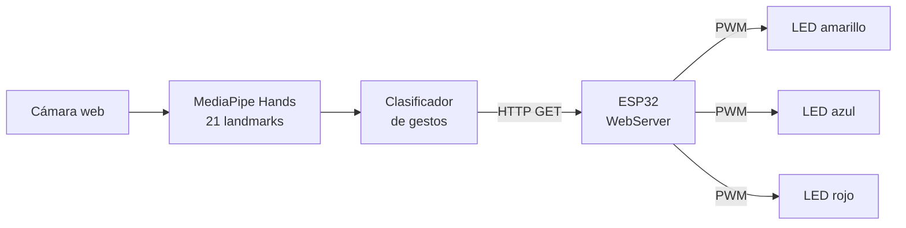

# tarea-4-micros-
<div align="center">

# GESTURE LIGHT CONTROL

### Iluminación inteligente controlada con la mano


**Universidad Militar Nueva Granada** · Microcontroladores

</div>

---

## Demostración

<div align="center">

[](https://youtube.com/shorts/-LupT8DJVoM)

**[▶ Ver el video de funcionamiento](https://youtube.com/shorts/-LupT8DJVoM)**

</div>

---

## Resumen

Este proyecto convierte la cámara de un computador en un **panel de control sin contacto**. La página web detecta la mano con MediaPipe, identifica el gesto y le manda la orden por WiFi a un ESP32, que enciende tres LEDs con distinta intensidad o ejecuta secuencias de luces.

---

## Tabla de gestos

| | Gesto | Resultado | Intensidad |
|:-:|-------|-----------|:----------:|
| ✊ | Puño cerrado | LED amarillo | **30 %** |
| ✌️ | Paz | LED azul | **70 %** |
| 🖐️ | Mano abierta | LED rojo | **100 %** |
| 👎 | Pulgar abajo | Secuencia de luces **Modo 1** | — |
| 👍 | Pulgar arriba | Secuencia de luces **Modo 2** | — |
| 🚫 | Sin mano (1 s) | Todo apagado | 0 % |

---

## Flujo del sistema



---

## Hardware

**Componentes**

- ESP32 DevKit
- 3 LEDs: amarillo, azul y rojo
- 3 resistencias de 220 Ω a 330 Ω
- Protoboard y cables jumper

**Pines**

```
GPIO 26 ──[R]──▶|── GND     Amarillo  (PWM canal 0)
GPIO 25 ──[R]──▶|── GND     Azul      (PWM canal 1)
GPIO 33 ──[R]──▶|── GND     Rojo      (PWM canal 2)
```

---

## Cómo funciona

<details>
<summary><b>Reconocimiento del gesto (navegador)</b></summary>

<br>

- Se procesa **una sola mano** con confianza mínima de 0.7.
- Un dedo se considera **doblado** si su punta queda cerca de la muñeca (menos de 0.65 veces el tamaño de la mano) o por debajo de su articulación PIP.
- El pulgar se evalúa por separado, según su distancia y su dirección vertical.
- Un gesto solo se acepta tras **5 fotogramas iguales seguidos**, para evitar lecturas falsas.
- Si la mano desaparece más de **1 segundo**, se envía la orden de apagado.
- Los modos 1 y 2 se envían **una sola vez** y la secuencia corre sola en el ESP32.

</details>

<details>
<summary><b>Firmware del ESP32</b></summary>

<br>

- Se conecta a la red WiFi y crea un servidor HTTP en el puerto 80.
- Genera PWM a 5 kHz con resolución de 8 bits.
- **Modo normal:** un solo LED encendido con la intensidad del gesto.
- **Modo 1** (500 ms por paso): amarillo 30 % → azul 70 % → rojo 100 % → azul 70 % → amarillo 30 %
- **Modo 2** (400 ms por paso): rojo → azul → amarillo → todos encendidos → todos apagados

</details>

<details>
<summary><b>API del ESP32</b></summary>

<br>

| Método | Ruta | Función |
|:------:|------|---------|
| `GET` | `/gesture?gesture=<g>&intensity=<n>` | Aplica un gesto |
| `GET` | `/status` | Devuelve el estado actual en JSON |
| `GET` | `/off` | Apaga todos los LEDs |

Valores válidos de `gesture`: `fist`, `peace`, `open_hand`, `thumbs_down`, `thumbs_up`.

```json
{"status":"ok","gesture":"peace","intensity":70,"mode":"normal"}
```

</details>

---

## Puesta en marcha

**1. Cargar el firmware**

1. Instala el Arduino IDE y el paquete de placas *esp32 by Espressif* (versión 2.x).
2. Edita tus credenciales en el `.ino`:
   ```cpp
   const char* ssid = "TU_RED_WIFI";
   const char* password = "TU_CONTRASEÑA";
   ```
3. Sube el código y copia la **IP** que aparece en el Monitor Serial (115200).

**2. Lanzar la interfaz**

1. En `index.html`, pon la IP de tu ESP32:
   ```js
   const ESP32_IP = 'http://TU_IP_DEL_ESP32';
   ```
2. Sirve la carpeta en local:
   ```bash
   python -m http.server 8000
   ```
3. Abre `http://localhost:8000` y pulsa **Iniciar Cámara**.

> **Importante:** el computador y el ESP32 deben estar en la misma red WiFi.

---

## Estructura

```
.
├── index.html          → interfaz web y detección de gestos
├── esp32_gestos.ino    → firmware del ESP32
└── README.md
```

---

## Créditos

Desarrollado por sara garcia valderrama 
Universidad Militar Nueva Granada · Microcontroladores

Basado en [MediaPipe Gesture Recognizer](https://google-ai-edge.github.io/mediapipe-samples-web/#/vision/gesture_recognizer).
